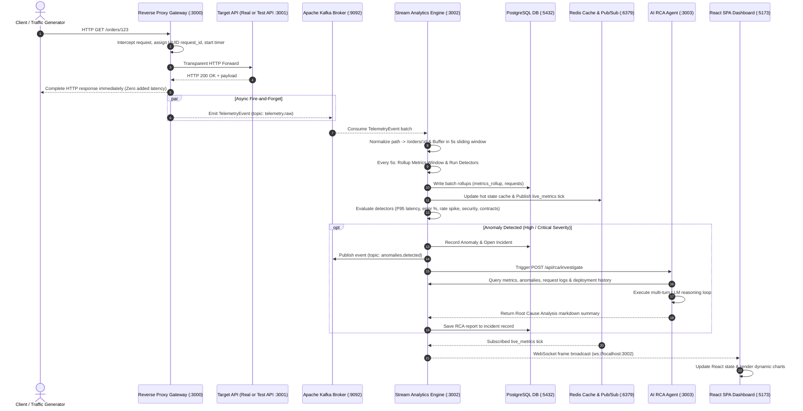

# System Architecture & Workflow Guide

An end-to-end architectural guide for the **API Intelligence Platform**, explaining component workflows, telemetry processing, core product services, real API integration, synthetic test APIs, and traffic simulation scripts.

---

## 1. System Architecture & End-to-End Workflow

The API Intelligence Platform is an event-driven, real-time observability system that sits transparently in front of HTTP APIs. It captures telemetry asynchronously, streams events through Apache Kafka, computes rolling metrics and statistical anomalies in real time, triggers AI-driven Root Cause Analysis (RCA), and broadcasts live state to a React dashboard.

### Architectural Overview

```
                      +----------------------------------+
                      | Client / Traffic Generator       |
                      +----------------------------------+
                                       |
                                       | HTTP Requests
                                       v
                      +----------------------------------+
                      | Reverse Proxy Gateway (:3000)    |
                      +----------------------------------+
                        /                              \
       (Async Fire-and-Forget)                  (Transparent Proxy)
                      /                                  \
                     v                                    v
   +----------------------------------+   +----------------------------------+
   | Apache Kafka Broker (:9092)      |   | Target Upstream API              |
   | topic: telemetry.raw             |   | (Real API or Test API :3001)     |
   +----------------------------------+   +----------------------------------+
                     |
                     | Consume Telemetry Stream
                     v
   +----------------------------------+
   | Stream Analytics Engine (:3002)  |
   | · Route Normalization            |
   | · 5s Sliding Windows             |
   | · Statistical Anomaly Detection  |
   | · Health Scoring & Incident Rules |
   +----------------------------------+
       /             |            \
      /              |             \
     v               v              v
+----------+   +-----------+   +-----------------------------------+
| PostgreSQL|  | Redis     |   | AI Root Cause Analysis (RCA)      |
| (:5432)  |   | (:6379)   |   | Agent (:3003) (Groq / Ollama)     |
+----------+   +-----------+   +-----------------------------------+
                     |                                |
                     | Pub/Sub Push                   | Context / Diagnosis
                     v                                v
   +-----------------------------------------------------------------+
   | Monitoring SPA Dashboard (:5173 dev / :80 Docker)               |
   +-----------------------------------------------------------------+
```

### Complete Sequence Diagram



---

## 2. Core Product vs. Test & Simulation Matrix

The project separates **core product infrastructure** from **synthetic test/simulation utilities**.

| Component / Module | Directory | Default Port | Category | Purpose in System |
|---|---|---|---|---|
| **Gateway** | [`packages/gateway`](file:///e:/Programming/api_monitor/packages/gateway) | `3000` | **Core Product** | Reverse proxy, UUID injection, fire-and-forget telemetry emitter, local buffer fallback |
| **Kafka Broker** | `infra/docker-compose` | `9092` | **Core Product** | Distributed streaming backbone (`telemetry.raw`, `anomalies.detected`) |
| **Analytics Engine** | [`packages/analytics`](file:///e:/Programming/api_monitor/packages/analytics) | `3002` | **Core Product** | Stream aggregation, sliding window rollups, statistical anomaly detection, REST/WS API server |
| **AI RCA Agent** | [`packages/rca-agent`](file:///e:/Programming/api_monitor/packages/rca-agent) | `3003` | **Core Product** | Autonomous LLM agent for automated root-cause analysis (Groq/Ollama) |
| **Dashboard** | [`packages/dashboard`](file:///e:/Programming/api_monitor/packages/dashboard) | `5173` / `80` | **Core Product** | React SPA visual dashboard (health scores, endpoint metrics, incident triage, deployment correlation) |
| **PostgreSQL** | [`infra/postgres`](file:///e:/Programming/api_monitor/infra/postgres) | `5432` | **Core Product** | Persistent data store for metrics rollups, raw request logs, anomalies, incidents, deployments |
| **Redis** | `infra/docker-compose` | `6379` | **Core Product** | Sub-millisecond hot state cache & real-time Pub/Sub broker for dashboard updates |
| **Shared Schemas** | [`packages/shared`](file:///e:/Programming/api_monitor/packages/shared) | — | **Core Product** | Shared Zod schemas and TypeScript interfaces across all product services |
| **Test API** | [`packages/test-api`](file:///e:/Programming/api_monitor/packages/test-api) | `3001` | **Testing / Demo** | Mock upstream API equipped with dynamic fault-injection endpoints (`/_fault/*`) |
| **Traffic Generator** | [`packages/traffic-generator`](file:///e:/Programming/api_monitor/packages/traffic-generator) | — | **Testing / Demo** | Background traffic loader and 9 automated E2E fault-injection scenario validation scripts |

---

## 3. Detailed Features of Core Product Modules

### 1. Gateway ([`packages/gateway/src/index.ts`](file:///e:/Programming/api_monitor/packages/gateway/src/index.ts))
- **Transparent Reverse Proxy**: Forwards all inbound HTTP requests to the target upstream URL specified by `UPSTREAM_URL`.
- **Zero Latency Impact**: Telemetry collection occurs asynchronously via fire-and-forget Kafka calls. Response streams back to the client instantly.
- **Resilience Buffer**: If Kafka is down or temporarily unreachable, telemetry events buffer into a local ring-buffer (up to 10,000 events) and auto-flush upon reconnection without dropping HTTP proxy requests.
- **Security Interception**: Detects failed authentication attempts and triggers `telemetry.security` events.
- **Route Normalization**: Automatically parameterizes dynamic URLs (e.g. `/orders/123` -> `/orders/:id`) to prevent metric cardinality explosion.

### 2. Stream Analytics Engine ([`packages/analytics/src/index.ts`](file:///e:/Programming/api_monitor/packages/analytics/src/index.ts))
- **Sliding Window Aggregator**: Buffers raw telemetry into 5-second sliding windows to compute throughput (RPS), P50/P95/P99 latency, error rates, and status code distributions.
- **Statistical Anomaly Detectors** ([`detectors.ts`](file:///e:/Programming/api_monitor/packages/analytics/src/detectors.ts)):
  - *Latency Spike Detector*: Triggers when P95 latency exceeds 2.5x the trailing median.
  - *Error Rate Detector*: Triggers when 5xx errors rise +10 percentage points above baseline and exceed 15%.
  - *Traffic Flood Detector*: Triggers on request volume Z-score > 2.5.
  - *Login Brute-Force Detector*: Triggers on 10+ failed login attempts from a single IP within 60s.
  - *Endpoint Enumeration Detector*: Triggers when a client probes 15+ unknown/404 routes.
- **Contract Validator** ([`contract-monitor.ts`](file:///e:/Programming/api_monitor/packages/analytics/src/contract-monitor.ts)): Checks live HTTP responses against embedded OpenAPI contracts for missing mandatory fields or illegal data types.
- **Incident Engine**: Automatically groups high-severity anomalies into active incidents and correlates them with recent code deployment markers.
- **Real-Time WebSocket Server**: Pushes metric ticks and incident updates directly to connected dashboard clients at `ws://localhost:3002`.

### 3. AI Root Cause Analysis Agent ([`packages/rca-agent/src/index.ts`](file:///e:/Programming/api_monitor/packages/rca-agent/src/index.ts))
- **Autonomous Multi-Turn Agent**: Uses LLMs (Groq Llama-3.3-70B or local Ollama) in an iterative tool-calling loop to diagnose production issues.
- **Diagnostic Toolset**:
  - `get_metrics`: Queries latency/throughput history around incident timestamps.
  - `get_anomaly`: Fetches anomaly evidence data.
  - `list_deployments`: Inspects code deployments prior to the incident.
  - `inspect_logs`: Fetches raw sampled error responses and stack traces.
  - `sample_requests`: Inspects payload structures and HTTP status codes.
- **Automated Incident Reports**: Generates detailed root cause diagnoses, impact statements, and remediation steps.

### 4. Real-Time SPA Dashboard ([`packages/dashboard`](file:///e:/Programming/api_monitor/packages/dashboard))
- **Overview Page (`/`)**: Displays real-time platform health scores, active throughput, latency charts, and live anomaly streams.
- **Endpoints Page (`/endpoints`)**: Deep-dive performance metrics for every API route.
- **Incidents Page (`/incidents`)**: Triage panel displaying open/resolved incidents, AI RCA summaries, evidence timelines, and manual RCA trigger actions.
- **Security Page (`/security`)**: Real-time view of brute-force attacks and scanner probes.
- **Deployments Page (`/deployments`)**: Code release history, deployment correlation markers, and a "Simulate Deploy" control form.

---

## 4. Connecting and Using Real APIs

To use the platform with a **real production or staging API**, follow these steps:

### Step 1: Configure Upstream Address
Modify `docker-compose.yml` or export the environment variable `UPSTREAM_URL` pointing to your real API service:

```bash
# Example: Monitored service running on host port 8080
UPSTREAM_URL=http://host.docker.internal:8080 docker compose up -d gateway
```

Or update the `gateway` service definition in `docker-compose.yml`:
```yaml
gateway:
  environment:
    PORT: "3000"
    UPSTREAM_URL: "http://your-real-api-host:8080"
```

### Step 2: Redirect Client Traffic
Point client applications, mobile apps, or frontend clients to the Gateway port (`http://localhost:3000` or your Gateway load balancer domain) instead of calling the upstream service directly.

```
Client App ---> http://gateway:3000 ---> http://your-real-api:8080
```

### Step 3: Configure Route Normalization (Crucial for Real APIs)
To ensure dynamic URL paths (e.g., `/api/v1/users/usr_98123/orders/ord_4412`) are correctly grouped into metric rollups, customize `getRouteTemplate()` in [`packages/gateway/src/index.ts`](file:///e:/Programming/api_monitor/packages/gateway/src/index.ts#L93-L100):

```typescript
function getRouteTemplate(path: string): string {
  // Regex parameter replacement for your real API routes:
  return path
    .replace(/\/users\/[^\/]+/, '/users/:id')
    .replace(/\/orders\/[^\/]+/, '/orders/:id')
    .replace(/\/products\/[^\/]+/, '/products/:id');
}
```

---

## 5. The Test API (`packages/test-api`)

The Test API ([`packages/test-api/src/index.ts`](file:///e:/Programming/api_monitor/packages/test-api/src/index.ts)) is a built-in, synthetic backend microservice running on **port 3001**. It simulates realistic API behaviour and includes a dynamic fault injection control plane.

### Endpoints

| Endpoint | Method | Description |
|---|---|---|
| `/` | `GET` | Health check & service metadata |
| `/orders` | `GET` | Returns list of recent orders from PostgreSQL |
| `/orders/:id` | `GET` | Returns order details by ID |
| `/users/:id` | `GET` | Returns user details by ID (connects to Postgres) |
| `/products` | `GET` | Returns static product catalog |
| `/login` | `POST` | Auth endpoint (`admin`/`admin` returns 200, others return 401) |

### Fault Injection Control Plane (`POST /_fault/:type`)

The Test API provides a dedicated endpoint to dynamically enable or disable runtime faults for testing detection pipelines:

```bash
# Enable 3-second latency delay on /orders
curl -X POST http://localhost:3001/_fault/latency_spike \
  -H "Content-Type: application/json" \
  -d '{"action": "enable", "targetRoute": "/orders"}'

# Enable 80% 500 error rate globally
curl -X POST http://localhost:3001/_fault/error_spike \
  -H "Content-Type: application/json" \
  -d '{"action": "enable", "rate": 0.8}'

# Enable unindexed slow DB query on /users/:id
curl -X POST http://localhost:3001/_fault/slow_query \
  -H "Content-Type: application/json" \
  -d '{"action": "enable"}'

# Enable response schema violation on /orders/:id
curl -X POST http://localhost:3001/_fault/schema_violation \
  -H "Content-Type: application/json" \
  -d '{"action": "enable"}'

# Disable a fault
curl -X POST http://localhost:3001/_fault/latency_spike \
  -H "Content-Type: application/json" \
  -d '{"action": "disable"}'
```

---

## 6. Traffic Simulation & Automated Scenario Scripts

The `traffic-generator` package ([`packages/traffic-generator`](file:///e:/Programming/api_monitor/packages/traffic-generator)) provides synthetic traffic generation and automated end-to-end validation suites.

### Traffic Execution Commands

```bash
cd packages/traffic-generator

# 1. Run continuous background steady-state traffic
npm run dev

# 2. Run all 9 validation scenarios sequentially (Full platform validation)
npm run validate

# 3. Run individual fault scenarios
npm run scenario:01   # Latency Spike
npm run scenario:02   # Error Spike
npm run scenario:03   # Traffic Flood
npm run scenario:04   # Login Flood (Brute Force)
npm run scenario:05   # Endpoint Enumeration (Scanner)
npm run scenario:05b  # Schema Violation (Contract Breach)
npm run scenario:06   # Deployment Correlation
npm run scenario:07   # Slow Query (DB Bottleneck)
npm run scenario:08   # Kafka Failure Resilience
npm run scenario:09   # Duplicate Telemetry Deduplication
```

### Detailed Breakdown of Scenario Scripts

#### 1. `01-latency-spike.ts` ([`scenario:01`](file:///e:/Programming/api_monitor/packages/traffic-generator/src/scenarios/01-latency-spike.ts))
- **What it does**: Establishes a 15-second normal baseline, injects a 3000ms delay on `/orders` via `/_fault/latency_spike`, and sends continuous requests.
- **Validation**: Asserts that the Analytics Engine detects a `latency_spike` anomaly (P95 > 1500ms) within 30 seconds.

#### 2. `02-error-spike.ts` ([`scenario:02`](file:///e:/Programming/api_monitor/packages/traffic-generator/src/scenarios/02-error-spike.ts))
- **What it does**: Injects an 80% 500 error rate fault via `/_fault/error_spike`.
- **Validation**: Verifies that the platform registers an `error_spike` anomaly and automatically opens a high-severity incident.

#### 3. `03-traffic-flood.ts` ([`scenario:03`](file:///e:/Programming/api_monitor/packages/traffic-generator/src/scenarios/03-traffic-flood.ts))
- **What it does**: Surges request volume from 5 RPS to 50+ RPS across all routes.
- **Validation**: Verifies that the Z-score traffic flood detector flags a `traffic_flood` anomaly.

#### 4. `04-login-flood.ts` ([`scenario:04`](file:///e:/Programming/api_monitor/packages/traffic-generator/src/scenarios/04-login-flood.ts))
- **What it does**: Sends 20 rapid invalid login requests (`POST /login` with bad passwords) from a single client.
- **Validation**: Asserts that a `login_flood` security anomaly is triggered and logged in the Security feed.

#### 5. `05-endpoint-enumeration.ts` ([`scenario:05`](file:///e:/Programming/api_monitor/packages/traffic-generator/src/scenarios/05-endpoint-enumeration.ts))
- **What it does**: Probes 20 non-existent random API paths (`/admin`, `/.env`, `/wp-login.php`, etc.).
- **Validation**: Confirms detection of an `endpoint_enumeration` security probe event.

#### 6. `05b-schema-violation.ts` ([`scenario:05b`](file:///e:/Programming/api_monitor/packages/traffic-generator/src/scenarios/05b-schema-violation.ts))
- **What it does**: Triggers `/_fault/schema_violation` causing `/orders/:id` to return malformed data types (string instead of number for monetary fields).
- **Validation**: Confirms that the OpenAPI `contract-monitor` catches and flags the contract breach.

#### 7. `06-deployment-correlation.ts` ([`scenario:06`](file:///e:/Programming/api_monitor/packages/traffic-generator/src/scenarios/06-deployment-correlation.ts))
- **What it does**: Registers a deployment marker (`v2.1.0`), then immediately injects a latency fault.
- **Validation**: Verifies that when the resulting incident is opened, it is automatically correlated with deployment `v2.1.0`.

#### 8. `07-slow-query.ts` ([`scenario:07`](file:///e:/Programming/api_monitor/packages/traffic-generator/src/scenarios/07-slow-query.ts))
- **What it does**: Triggers `/_fault/slow_query` on `/users/:id`, causing an unindexed database join in PostgreSQL.
- **Validation**: Asserts that database degradation is caught by latency metrics and flagged for AI RCA investigation.

#### 9. `08-kafka-failure.ts` ([`scenario:08`](file:///e:/Programming/api_monitor/packages/traffic-generator/src/scenarios/08-kafka-failure.ts))
- **What it does**: Simulates a total Kafka outage during active HTTP traffic.
- **Validation**: Confirms the Gateway gracefully switches to local memory buffering without dropping or slowing down client HTTP requests, and auto-flushes when Kafka recovers.

#### 10. `09-duplicate-events.ts` ([`scenario:09`](file:///e:/Programming/api_monitor/packages/traffic-generator/src/scenarios/09-duplicate-events.ts))
- **What it does**: Emits identical duplicate telemetry payloads directly to Kafka.
- **Validation**: Confirms that database rollups deduplicate events based on `request_id` to maintain accurate metric calculations.
